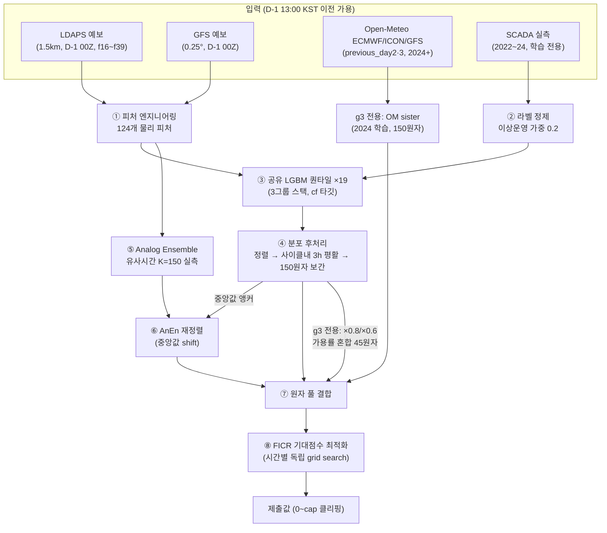

# 모델 파이프라인 명세 (공식 구성: sub_029, LB 0.64760)

> 생성 스크립트: `scripts/make_submission_v29_q3.py` · 최종 갱신: 2026-07-22
> sub_026 대비 변경: **고출력 가중 학습** (#83·#84) — main GBM 가중 ×(1+3·cf²), 오차 예산을
> FICR 에너지 가중에 정렬. FICR +0.0077 (역대 최대, 전이율 >1 최초 — 2025 강풍 해 증폭).
> sub_021 대비 변경: **희귀 레짐 재배분** (#77·#78) — 아날로그 평균거리 d̄의 3분위
> (예측 집합 자체 기준)로 원자 재배분: 멂 anen175+gbm125 / 중간 150+150 / 가까움 125+175,
> g3는 OM sister 원자 수도 동일 문법(125/150/175)으로 조건부.
> FICR +0.0011+0.0004 (phys5에 이은 FICR 2대 개선축, 전이율 ~1/4~1/10).
> 1-NMAE 0.87551 / FICR 0.41237.
> 이 문서는 "현재 무엇이 어떻게 돌아가는가"의 단일 진실 소스다.
> 구조 변경 실험 전에 반드시 이 문서로 현재 상태를 확인하고, 채택 시 갱신한다.

## 0. 한 장 요약

| 항목 | 값 |
|---|---|
| 점수 이력 | sub_009 0.64018 → sub_013 0.64086 → sub_017 0.64134 → sub_020 0.64167 → sub_021 0.64324 → sub_025 0.64390 → sub_026 0.64394 → sub_028 0.64718 → **sub_029 0.64760** (최상위 0.66912) |
| 분해 | 1-NMAE 0.87261 / FICR 0.42260 (최상위 .88483 / .45342 — **격차의 ~82%가 FICR**) |
| 그룹별 CV (#40) | g1 0.656 / **g2 0.666 (FICR .452 = 최상위급)** / g3 0.619 (병목) |

## 1. 입력 데이터와 누수 규약

- **예측기준시점**: 대상일 D의 24시간 전부에 대해 cutoff = D-1 13:00 KST.
- 제공 LDAPS/GFS는 D-1 00Z 런 (리드 12~35h). 같은 행의 `forecast_kst_dtm` 예보 사용은 안전.
- `forecast_kst_dtm` = **집계 구간 종료 시각** (01:00 행 = 00~01시).
- OM previous_day2/3: 발표시각 근거 문서화됨 (`external_data/README.md`) — 전 시간 안전.
- 2025년 실측·SCADA·재분석(ERA5)·사후자료 일절 금지.

## 2. 단계별 상세

### ① 피처 엔지니어링 — `src/features.py::build_features(ldaps, gfs)` → 124열

| 블록 | 구성 | 열수 |
|---|---|---|
| 풍속 스칼라 | LDAPS 4고도(10m/50max/50min/5bl) + GFS 6고도(10/80/100/pbl/850/700) × {전격자 평균, 격자 std(gstd), 최근접 4격자(g0~g3)} | 60 |
| 풍향 | 각 고도 dsin/dcos (전격자 평균) | 20 |
| 기상 스칼라 | LDAPS 8종(기온·습도·기압·BLH·단파·운량·강수) + GFS 8종(기온·습도·기압·gust·강수·운량·850T·500gh) | 16 |
| 물리 파생 | air_density, wpd_100m(ρv³), wpd_ldaps50, shear_100_10, shear_850_100, ldaps_gust_ratio, **ws_ldaps_gfs_diff**(유일한 소스 결합 피처) | 7 |
| 사이클 문맥 | {gfs_ws100, ldaps_ws50max, wpd_100m, gust} × {roll3, diff1, dmax, dmean} — **사이클(대상일 24h 블록) 내부만** (누수 차단) | 16 |
| 캘린더 | hour/month sin·cos, lead_h(12~35) | 5 |

- **원칙**: 격자별 스칼라 풍속 계산 후 집계 (벡터평균 금지 — v³ 편향). 요일 피처 금지.
- 모델 입력 시 그룹 피처 3개 추가: `g_rated`(3600/4200), `g_rotor`(126/136), `g_id`(0/1/2) → **127열**.

### ② 라벨 정제 — `train_v2_clean_shared.py::label_weights`

- SCADA 팜 평균 풍속으로 0.5m/s bin별 발전량 90퍼센타일 = "정상 상한 곡선".
- 풍속>5m/s인데 발전량<곡선의 30% → 이상운영(정지/제한) 추정 → **가중 0.2** (기본 1.0).
- 이상 비율: g1 ~2.6% / g2 ~2.5% / g3 ~1.9%.

### ③ 공유 GBM — LGBM 퀀타일 19개 (α=0.05~0.95, 0.05 간격)

- 3그룹을 capacity-factor(발전량/설비용량) 타깃으로 **스택해 단일 모델셋** 학습 (g3 데이터 부족 보완, LB +0.006).
- `BASE_PARAMS`: n_estimators=700, lr=0.05, num_leaves=63, min_child_samples=40, colsample=0.8, subsample=0.8(freq=1), seed=42.
  - **LB 검증된 설정. 튜닝 철회 이력**(#9: 배깅 무작위성 제거 설정이 2025 분포이동에 취약, LB -0.009).
- 학습 데이터: g1/g2 2022~2024 (~26,200시간), g3 2023~2024 (~17,500시간).

### ④ 분포 후처리 — `src/decision.py`

1. 열 정렬(퀀타일 교차 제거)
2. `smooth_quantiles_by_day`: 같은 대상일 블록 내 3h 중심 이동평균 (OOF +0.006)
3. 재정렬 후 `interp_atoms(n=150)`: 퀀타일 함수 선형보간 → **등확률 원자 150개** (OOF +0.003)

### ⑤ Analog Ensemble — `train_v11_anen.py` 정의

- 검색 공간: `ANEN_FEATS` 12개 (풍속 5고도 + gust + 풍향 sin/cos + 시각/월 sin/cos), 표준화 후 `FEAT_W`(풍속 2.0~1.0, 캘린더 0.5) 배율, 유클리드 KNN.
- 라이브러리: **전체 학습기간**의 실측 cf (그룹별). 각 예측 시각마다 유사 K=150개 시각의 실측 → 원자 150개.
- 본질: GBM이 못 담는 **실현 변동성**(라벨 노이즈, 부분정지, 국지 효과의 실제 분포)을 공급.

### ⑥ AnEn 재정렬 (핵심 트릭, LB +0.007)

- `shift = median(GBM 원자) − median(AnEn 원자)` 를 AnEn 원자 전체에 더함.
- 효과: AnEn의 **분포 모양**(퍼짐·왜도)만 취하고 **위치는 GBM을 신뢰** — AnEn 단독의 점 열세(-0.03)를 제거.
- 재정렬 없는 blend는 NMAE 악화로 상쇄(#25), 2:1 증량은 LB 하락(#31→1:1 확정).

### ⑦ 원자 풀 결합 (그룹별 차등)

| 그룹 | 원자 구성 | 총수 |
|---|---|---|
| g1, g2 | GBM+AnEn(재정렬) 300 — **희귀 레짐 재배분**: d̄ 3분위로 멂 anen175+gbm125 / 중간 150+150 / 가까움 125+175 (#77, FICR +0.0011) | 300 |
| g3 | + 가용률 혼합: GBM×0.8 30개, GBM×0.6 15개 (부분정지 하방 모드, LB +0.0005) + OM sister **조건부 125/150/175개** (#78, 2024학습 ECMWF/ICON 피처, raw) | 470~520 |

### ⑧ FICR 기대점수 최적화 — `src/decision.py::optimize_submission`

- 원자를 등확률 분포로 보고 시간별 독립으로 기대점수 최대화:
  `J(g) = mean[ −0.5·|g−a|/C + 0.5·a·price(|g−a|/C)/(4·Ā) ]`, price: ≤6%→4, ≤8%→3, 초과→0
- 원자 < 0.1C 절단(평가 제외 시간 반영). 유효 원자 <2개면 중앙값 제출.
- 후보: 유효 원자 범위 61그리드 + 원자 자신들. Ā = 학습기간 유효시간 평균 발전량.
- LB +0.016의 최대 단일 기여. **산식이 시간별 가법이라 시간별 독립 의사결정이 최적** (시퀀스 정보의 활용 통로 없음 — #34).

## 3. 검증 체계

- **CV**: 2024년 2개월×6 fold rolling-origin (학습 = fold 시작 이전 전체). 공식 `metric()` 사용.
- **OOF 캐시**: `experiments/oof_cache/{fold}_{group}.npz` (qp·anen·actual·a_bar) — 의사결정층 실험은 재학습 없이 초 단위 반복.
- **알려진 함정 4가지** (실증):
  1. CV는 2024 검증뿐 → 2025 분포이동 못 봄 (#9: CV +0.004 ↔ LB -0.009)
  2. rolling-origin CV는 최근성 계열 이득을 구조적으로 부풀림 (#20: CV +0.008 ↔ LB -0.013)
  3. **인접 홀드아웃도 동일** — 2024-only 학습 요소의 홀드아웃 이득은 LB에서 ~1/20로 축소 (#48)
  4. **학습분포 적합도를 높이는 변경(특이화·정칙화 완화·최근성)은 CV fold 일관성으로도 못 거름**
     (#51b: g2 자기모델 5/6 fold승 CV +0.006 ↔ LB -0.0021, FICR만 붕괴). 공유 학습의 풀링이
     암묵적 정칙화 = 2025 전이의 방어선. 특이화 방향은 원칙 회피.

## 4. 블록별 채택 근거와 닫힌 대안 (요약)

| 블록 | 채택 근거 (LB) | 기각된 대안 (원인) |
|---|---|---|
| 피처 | 기본 124개로 근포화 | 추가 7연속 실패 (분할 희석 + 2024 노이즈 적합) |
| GBM | 공유 학습 +0.006 | XGB/CatBoost 원자(품질 열세), NN(마지널 열세), 시드 앙상블(다양성 없음), 튜닝(이동 취약) |
| 분포 | 평활+보간 +0.005 | 폭 조절/샤프닝/재보정 (분포 이미 적정 #45), 외부 불확실성 주입 5연속 |
| AnEn | 재정렬 1:1 +0.007 | 2:1(과적합), KMA 유사도(동률), 일-아날로그(거칠음), 라이브러리 정화(무효) |
| g3 | 혼합+sister +0.0007 | 유사라벨 증강(변동성 없음), 터빈 bottom-up/ECC(상관 비전이) |
| 의사결정 | FICR 최적화 +0.016 | a_bar 월별화(무효), 원자 해상도 증가(포화) |

## 5. 미탐색 지점 (개선 후보 도출용 — 문서 갱신 시 유지할 것)

- **g1 미해결 질문**: g2와 동일 하드웨어인데 CV -0.010 (#40). 풍향 조건부(후류)/터빈 배치 오차 진단 미실시.
- **FICR 격차의 구조**: 우리 .409 vs 최상위 .453. g2는 .452 도달 → 방법이 아니라 g1/g3의 조건부 분포 품질 문제.
- **AnEn 검색 공간**: 가중치 FEAT_W는 수동 설정 — 학습된 메트릭(거리 최적화) 미시도. K=150 고정 — 조건부 K(불확실성 따라 가변) 미시도.
- **평활화 파라미터**: 3h 고정 — 레짐(램프 vs 안정) 조건부 미시도. 램프 약점은 #15부터 잔존 과제.
- **quantile 해상도**: 0.05~0.95 (꼬리 q02/q98은 #20에 섞여 미분리 판정).
- **다중 NWP 컨센서스 피처**: ws_ldaps_gfs_diff 1개뿐 — IFS 도착 시 3원 컨센서스/불일치 (외부데이터 감사 결론).
- **잔차 오프셋 부스팅**: base 예측을 init_score로 외부/신규 피처만 잔차 학습 — 미시도 방법론.
