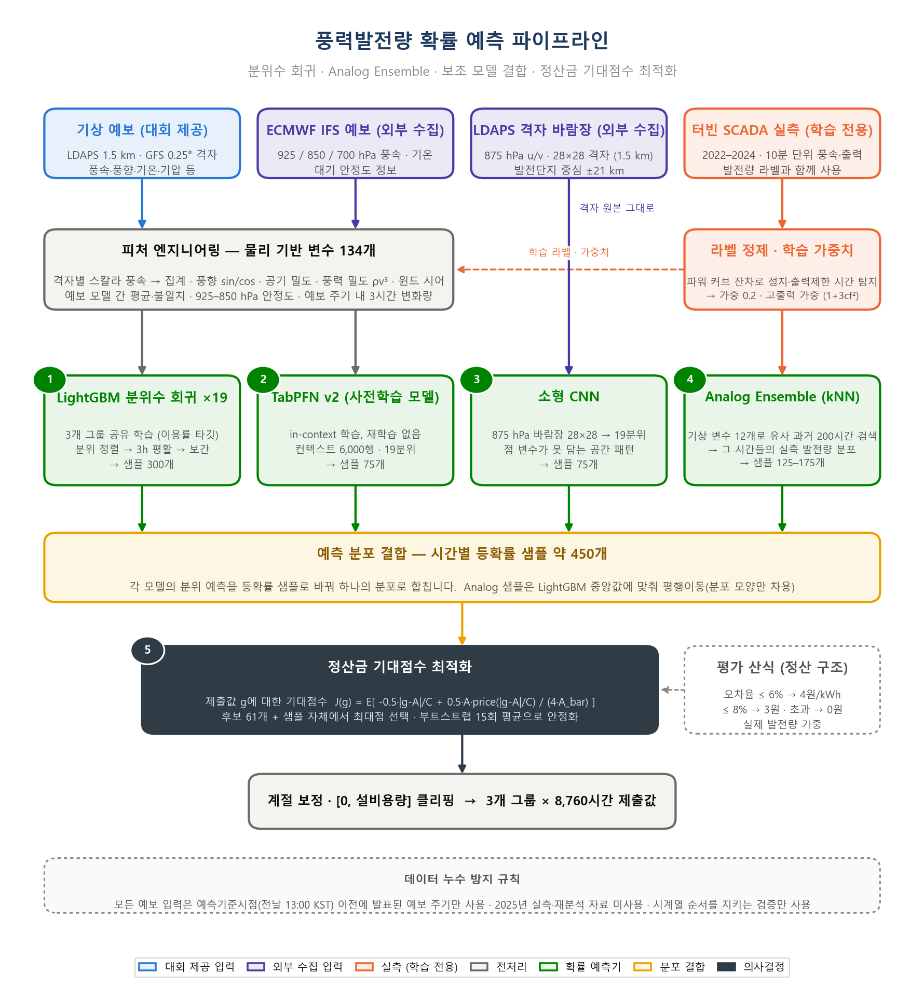
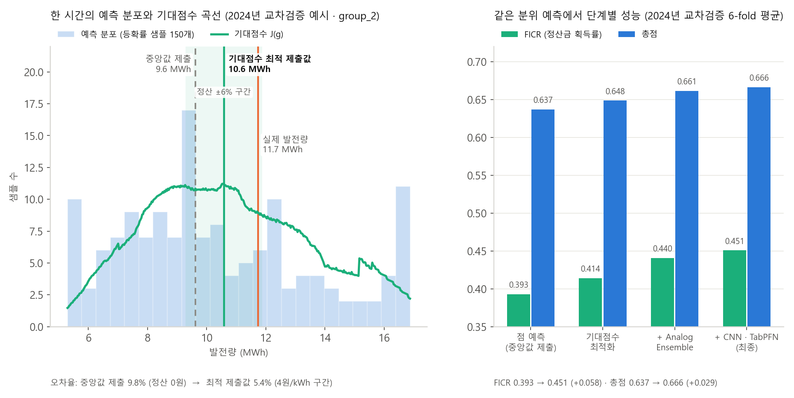
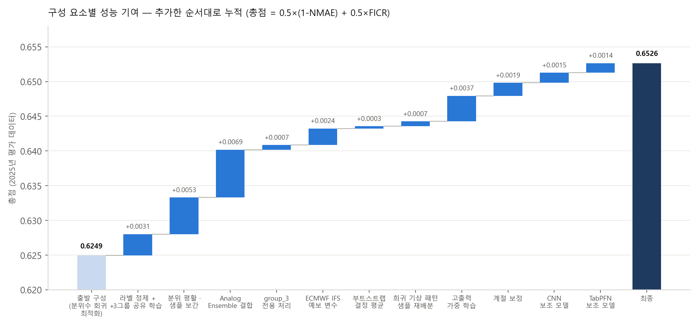

# BARAM 2026 — 기상예보 기반 풍력발전량 확률 예측

제3회 풍력발전량 예측 AI 경진대회(BARAM 2026, DACON)에서 태백 가덕산 풍력단지 3개 발전기 그룹의
2025년 시간별 발전량을 전날 발표된 기상예보만으로 예측한 개인 프로젝트입니다.

- 기간: 2026.07 – 2026.08 · 개인 프로젝트
- 결과: **985팀 중 27위** (최종 평가 기준)
- 기술: Python, LightGBM(분위수 회귀), PyTorch(CNN), TabPFN v2, NumPy / Pandas

## 문제

- 입력: 전날 13:00 KST에 공개되는 기상청 LDAPS(1.5 km) · NOAA GFS(0.25°) 예보
- 출력: 3개 그룹 × 8,760시간의 발전량(kWh)
- 평가: `총점 = 0.5 × (1 − NMAE) + 0.5 × FICR`
  - FICR(정산금 획득률)은 설비용량 대비 오차율이 6% 이내면 4원/kWh, 8% 이내면 3원, 초과하면 0원을
    받는 **계단형 정산 구조**를 실제 발전량으로 가중한 값입니다.
  - 평균 오차를 줄이는 것과 오차를 ±6% 구간 안에 넣는 것은 다른 문제이므로, 점 예측이 아니라
    **시간별 발전량의 확률 분포를 예측하고 그 분포에서 산식의 기대점수가 최대가 되는 값을 제출**하는
    구조로 문제를 재정의했습니다.

## 접근



1. **피처 엔지니어링** — 격자별 스칼라 풍속을 먼저 계산한 뒤 집계(벡터 평균은 v³ 편향), 공기 밀도·풍력
   밀도 ρv³·윈드 시어, 예보 모델 간 평균·불일치, 925–850 hPa 층의 대기 안정도, 예보 주기 내부로 한정한
   3시간 변화량 등 물리 기반 변수 134개 ([src/features.py](src/features.py)).
2. **라벨 정제 · 가중치** — SCADA 파워 커브 잔차로 정지·출력제한 시간(약 2%)을 찾아 가중 0.2로 낮추고,
   손실 가중을 (1+3·cf²)로 두어 정산 구조의 에너지 가중과 학습 목적을 정렬.
3. **확률 예측기** — LightGBM 분위수 회귀 19개(3그룹 공유 학습)를 주 모델로, 유사 기상 시간의 실측
   분포를 가져오는 Analog Ensemble, LDAPS 875 hPa 격자 바람장을 읽는 소형 CNN, 사전학습 표 모델
   TabPFN v2를 보조 모델로 결합. 각 모델의 분위 예측을 등확률 샘플로 바꿔 시간당 약 450개의 샘플로
   하나의 예측 분포를 구성.
4. **정산금 기대점수 최적화** — 예측 분포 위에서 제출값 g의 기대점수
   `J(g) = E[−0.5·|g−A|/C + 0.5·A·price(|g−A|/C)/(4·Ā)]` 를 직접 계산해 최대점을 제출
   ([src/decision.py](src/decision.py)). 부트스트랩 15회 평균으로 선택점을 안정화.



## 결과

2024년 시계열 교차검증(2개월 × 6 fold, rolling-origin) 기준, 같은 분위 예측에서 단계별 성능:

| 단계 | 총점 | 1 − NMAE | FICR |
|---|---|---|---|
| 점 예측 (중앙값 제출) | 0.637 | 0.881 | 0.393 |
| 기대점수 최적화 | 0.648 | 0.883 | 0.414 |
| + Analog Ensemble | 0.661 | 0.882 | 0.440 |
| + CNN · TabPFN (최종) | **0.666** | 0.882 | **0.451** |

2025년 평가 데이터 총점 0.652 · 985팀 중 27위.



## 일반화를 위한 원칙

- 학습 데이터(2022–2024)와 평가 연도(2025)의 분포가 다르다는 전제로, 모든 검증을 시계열 순서를 지키는
  분할로만 수행하고 미래 정보가 섞이는 파생 변수를 만들지 않았습니다.
- 3개 그룹을 하나의 모델로 공유 학습해 그룹 공통 패턴만 배우게 하고, 특정 연도·그룹에 맞추는
  하이퍼파라미터 튜닝은 배제했습니다.
- 모든 외부 데이터는 예측기준시점(전날 13:00 KST) 이전에 발표된 예보 주기만 사용했으며, 출처·라이선스·
  발표 시각 근거를 [external_data/README.md](external_data/README.md)에 기록했습니다.

## 저장소 구성

```
src/                 피처 생성(features.py) · 평가 산식(metric.py) · 기대점수 최적화(decision.py)
scripts/             실험 스크립트 (train_v*.py) · 외부 데이터 수집기 (collect_*.py) · 제출 생성기
submission_package/  최종 모델 학습·추론 코드 (train.py / inference.py / lib.py)
experiments/log.md   실험 기록 (131회 실험, 판정 근거 포함)
docs/, research/     방법론 탐색 · 도메인 이론 조사 노트
external_data/       외부 데이터 출처·라이선스·누수 안전 근거 (데이터 본문은 미포함)
assets/              README 그림
```

대회 제공 데이터(`Data/`), 수집한 외부 데이터 본문, 학습된 모델 가중치는 용량과 재배포 제한으로 저장소에
포함하지 않았습니다. 최종 모델을 재현하려면 `submission_package/README.md`의 안내에 따라 데이터를
배치한 뒤 `train.py` → `inference.py` 순으로 실행합니다.

```
pip install -r submission_package/requirements.txt
python submission_package/train.py
python submission_package/inference.py
```
